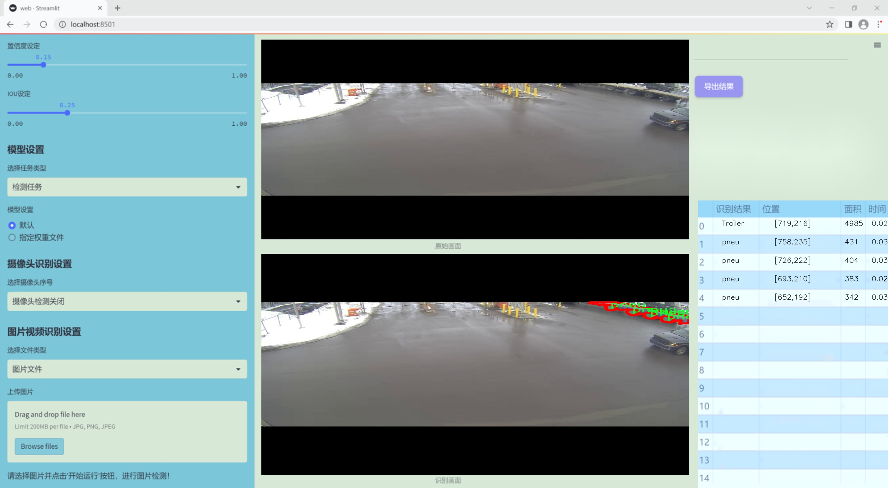
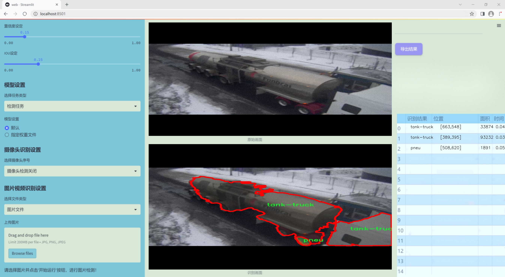
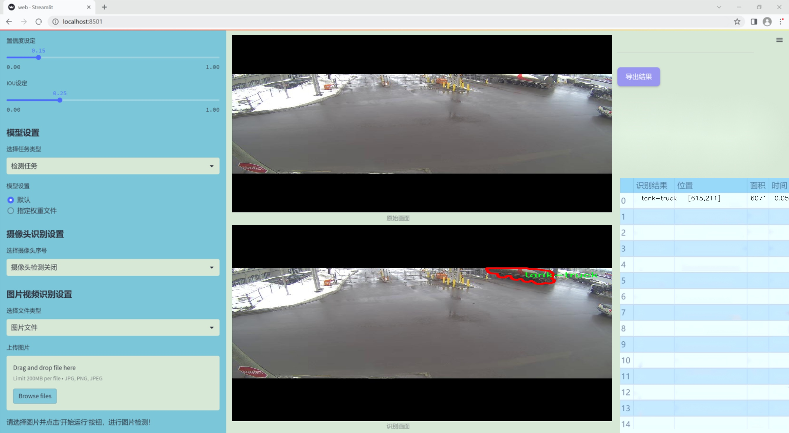
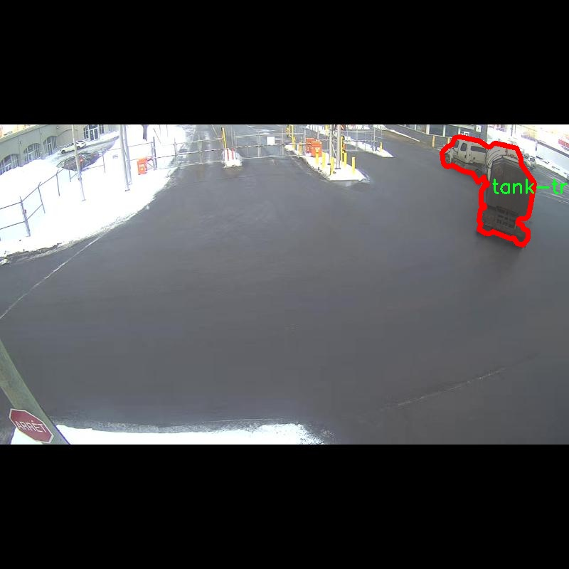
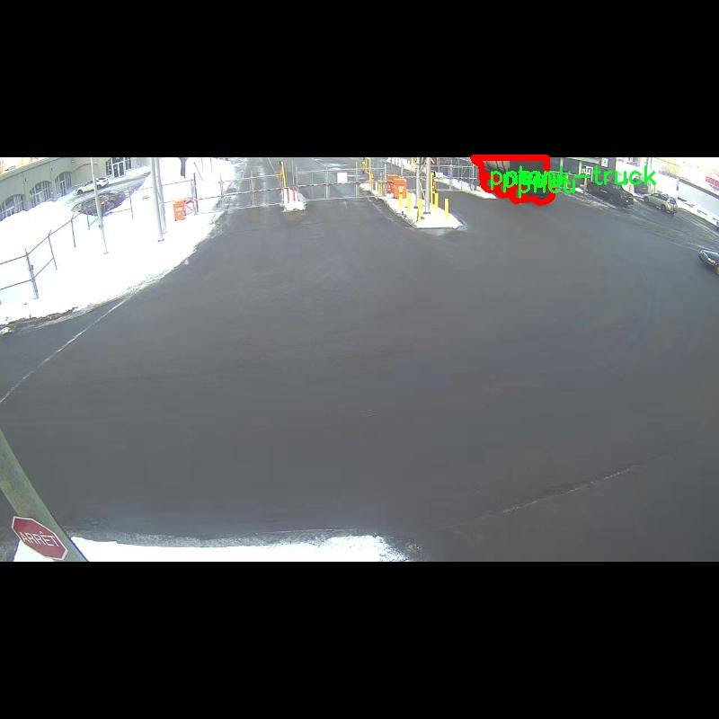
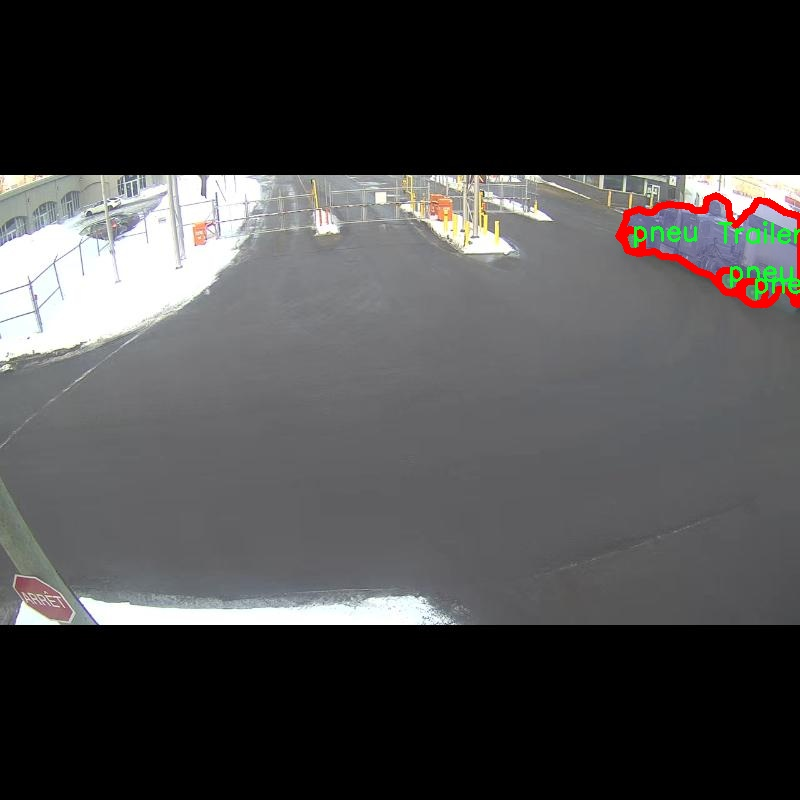
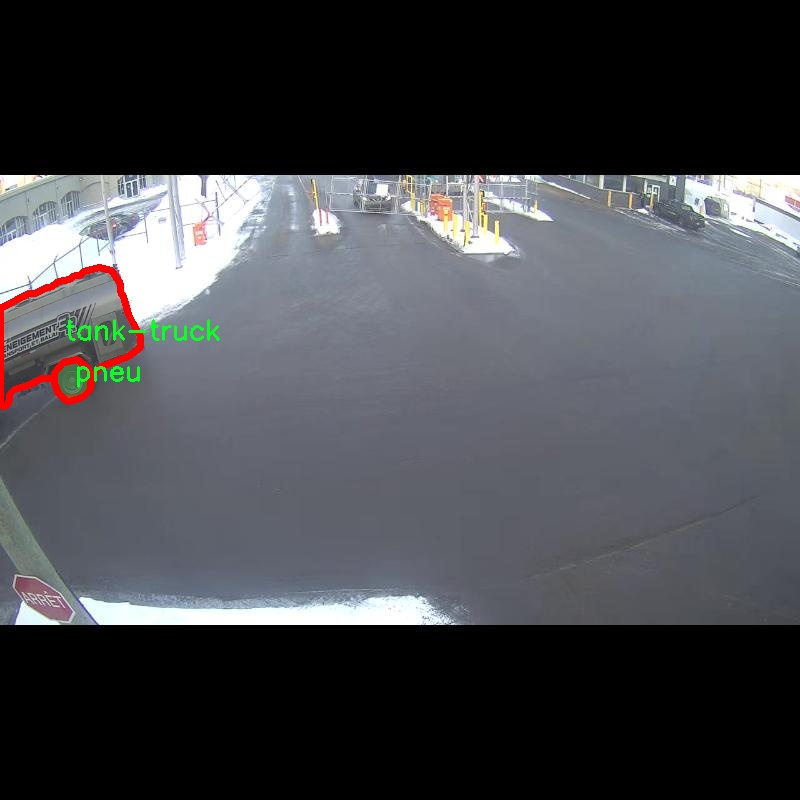
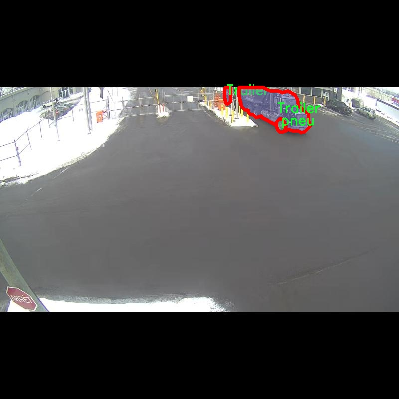

### 1.背景意义

研究背景与意义

随着城市化进程的加快，交通运输需求的日益增长，卡车作为重要的货物运输工具，其安全性和效率受到越来越多的关注。尤其是在物流行业，卡车的实时监控与管理不仅能够提高运输效率，还能有效降低事故发生率。因此，开发一种高效的卡车实例分割系统显得尤为重要。传统的图像处理技术在复杂场景下的表现往往不尽如人意，尤其是在多种类卡车的识别与分割任务中，存在着识别精度低、处理速度慢等问题。

近年来，深度学习技术的迅猛发展为计算机视觉领域带来了新的机遇，尤其是基于卷积神经网络（CNN）的目标检测与实例分割技术。YOLO（You Only Look Once）系列模型因其高效的实时处理能力和较高的准确率，逐渐成为目标检测领域的主流选择。YOLOv11作为该系列的最新版本，进一步提升了模型的性能，尤其是在处理复杂背景和多目标情况下的表现。

本研究旨在基于改进的YOLOv11模型，构建一个针对卡车的实例分割系统。我们使用的数据集包含1100张图像，涵盖了四类卡车：拖车、轮胎、油罐车和自卸车。通过对这些图像的标注与分析，我们希望能够提升模型在卡车实例分割任务中的准确性和鲁棒性。此外，研究中还将探讨数据预处理对模型性能的影响，以期为后续的实际应用提供参考。

本项目的研究不仅具有重要的学术价值，也对实际的交通管理与物流优化具有深远的意义。通过提升卡车实例分割的精度与效率，能够为智能交通系统的构建提供有力支持，推动物流行业的智能化发展。

### 2.视频效果

[2.1 视频效果](https://www.bilibili.com/video/BV1gEk9YUExG/)

### 3.图片效果







##### [项目涉及的源码数据来源链接](https://kdocs.cn/l/cszuIiCKVNis)**

注意：本项目提供训练的数据集和训练教程,由于版本持续更新,暂不提供权重文件（best.pt）,请按照6.训练教程进行训练后实现上图演示的效果。

### 4.数据集信息

##### 4.1 本项目数据集类别数＆类别名

nc: 3
names: ['Trailer', 'pneu', 'tank-truck']


该项目为【图像分割】数据集，请在【训练教程和Web端加载模型教程（第三步）】这一步的时候按照【图像分割】部分的教程来训练

##### 4.2 本项目数据集信息介绍

本项目数据集信息介绍

本项目旨在改进YOLOv11的卡车实例分割系统，因此所使用的数据集专注于“Truck segmentation”这一主题。该数据集包含了与卡车相关的多种实例，涵盖了三种主要类别，分别为“Trailer”、“pneu”和“tank-truck”。这些类别的选择不仅反映了卡车的多样性，也为模型的训练提供了丰富的样本，以提高其在实际应用中的表现。

数据集中包含的“Trailer”类别，代表了拖车这一重要的运输工具，广泛应用于物流和货物运输行业。通过对拖车的精确分割，模型能够更好地识别和定位拖车在复杂场景中的位置，从而为后续的自动驾驶或运输管理系统提供支持。“pneu”类别则专注于卡车的轮胎部分，轮胎作为车辆的重要组成部分，其状态直接影响到行驶安全和效率。通过对轮胎的实例分割，系统能够监测轮胎的磨损情况，及时发出维护警报，提升车辆的安全性和可靠性。而“tank-truck”类别则涵盖了罐式卡车，这类车辆通常用于运输液体或气体，具有特殊的结构和功能。对罐式卡车的精确识别与分割，能够为危险品运输的安全管理提供数据支持。

整个数据集的构建经过精心设计，确保了每个类别的样本在不同环境和角度下的多样性，以增强模型的泛化能力。通过对这些类别的深入学习，改进后的YOLOv11模型将能够在复杂的实际场景中实现高效的卡车实例分割，推动智能交通和物流领域的发展。数据集的丰富性和多样性为本项目的成功奠定了坚实的基础，期待通过这一研究，推动卡车实例分割技术的进一步进步。











### 5.全套项目环境部署视频教程（零基础手把手教学）

[5.1 所需软件PyCharm和Anaconda安装教程（第一步）](https://www.bilibili.com/video/BV1BoC1YCEKi/?spm_id_from=333.999.0.0&vd_source=bc9aec86d164b67a7004b996143742dc)


[5.2 安装Python虚拟环境创建和依赖库安装视频教程（第二步）](https://www.bilibili.com/video/BV1ZoC1YCEBw?spm_id_from=333.788.videopod.sections&vd_source=bc9aec86d164b67a7004b996143742dc)

### 6.改进YOLOv11训练教程和Web_UI前端加载模型教程（零基础手把手教学）

[6.1 改进YOLOv11训练教程和Web_UI前端加载模型教程（第三步）](https://www.bilibili.com/video/BV1BoC1YCEhR?spm_id_from=333.788.videopod.sections&vd_source=bc9aec86d164b67a7004b996143742dc)


按照上面的训练视频教程链接加载项目提供的数据集，运行train.py即可开始训练



     Epoch   gpu_mem       box       obj       cls    labels  img_size
     1/200     20.8G   0.01576   0.01955  0.007536        22      1280: 100%|██████████| 849/849 [14:42<00:00,  1.04s/it]
               Class     Images     Labels          P          R     mAP@.5 mAP@.5:.95: 100%|██████████| 213/213 [01:14<00:00,  2.87it/s]
                 all       3395      17314      0.994      0.957      0.0957      0.0843

     Epoch   gpu_mem       box       obj       cls    labels  img_size
     2/200     20.8G   0.01578   0.01923  0.007006        22      1280: 100%|██████████| 849/849 [14:44<00:00,  1.04s/it]
               Class     Images     Labels          P          R     mAP@.5 mAP@.5:.95: 100%|██████████| 213/213 [01:12<00:00,  2.95it/s]
                 all       3395      17314      0.996      0.956      0.0957      0.0845

     Epoch   gpu_mem       box       obj       cls    labels  img_size
     3/200     20.8G   0.01561    0.0191  0.006895        27      1280: 100%|██████████| 849/849 [10:56<00:00,  1.29it/s]
               Class     Images     Labels          P          R     mAP@.5 mAP@.5:.95: 100%|███████   | 187/213 [00:52<00:00,  4.04it/s]
                 all       3395      17314      0.996      0.957      0.0957      0.0845


###### [项目数据集下载链接](https://kdocs.cn/l/cszuIiCKVNis)

### 7.原始YOLOv11算法讲解


##### YOLOv11三大损失函数

YOLOv11（You Only Look Once）是一种流行的目标检测算法，其损失函数设计用于同时优化分类和定位任务。YOLO的损失函数通常包括几个部分：
**分类损失、定位损失（边界框回归损失）和置信度损失** 。其中，

  1. box_loss（边界框回归损失）是用于优化预测边界框与真实边界框之间的差异的部分。

  2. cls_loss（分类损失）是用于优化模型对目标类别的预测准确性的部分。分类损失确保模型能够正确地识别出图像中的对象属于哪个类别。

  3. dfl_loss（Distribution Focal Loss）是YOLO系列中的一种损失函数，特别是在一些改进版本如YOLOv5和YOLOv7中被引入。它的主要目的是解决目标检测中的类别不平衡问题，并提高模型在处理小目标和困难样本时的性能。

##### 边界框回归损失详解

box_loss（边界框回归损失）是用于优化预测边界框与真实边界框之间的差异的部分。


##### box_loss 的具体意义


##### 为什么需要 box_loss

  * 精确定位：通过最小化中心点坐标损失和宽高损失，模型能够更准确地预测目标的位置和大小。
  * 平衡不同类型的目标：使用平方根来处理宽高损失，可以更好地平衡不同大小的目标，确保小目标也能得到足够的关注。
  * 稳定训练：适当的损失函数设计有助于模型的稳定训练，避免梯度爆炸或消失等问题。

##### 分类损失详解

在YOLO（You Only Look
Once）目标检测算法中，cls_loss（分类损失）是用于优化模型对目标类别的预测准确性的部分。分类损失确保模型能够正确地识别出图像中的对象属于哪个类别。下面是关于cls_loss的详细解读：

##### 分类损失 (cls_loss) 的具体意义

  
分类损失通常使用交叉熵损失（Cross-Entropy
Loss）来计算。交叉熵损失衡量的是模型预测的概率分布与真实标签之间的差异。在YOLO中，分类损失的具体形式如下：


##### 为什么需要 cls_loss

  * 类别识别：cls_loss 确保模型能够正确识别出图像中的目标属于哪个类别。这对于目标检测任务至关重要，因为不仅需要知道目标的位置，还需要知道目标的类型。

  * 多类别支持：通过最小化分类损失，模型可以处理多个类别的目标检测任务。例如，在道路缺陷检测中，可能需要识别裂缝、坑洞、路面破损等多种类型的缺陷。

  * 提高准确性：分类损失有助于提高模型的分类准确性，从而提升整体检测性能。通过优化分类损失，模型可以更好地学习不同类别之间的特征差异。

##### 分布损失详解

`dfl_loss`（Distribution Focal
Loss）是YOLO系列中的一种损失函数，特别是在一些改进版本如YOLOv5和YOLOv7中被引入。它的主要目的是解决目标检测中的类别不平衡问题，并提高模型在处理小目标和困难样本时的性能。下面是对`dfl_loss`的详细解读：

##### DFL Loss 的背景

在目标检测任务中，类别不平衡是一个常见的问题。某些类别的样本数量可能远远多于其他类别，这会导致模型在训练过程中对常见类别的学习效果较好，而对罕见类别的学习效果较差。此外，小目标和困难样本的检测也是一个挑战，因为这些目标通常具有较少的特征信息，容易被忽略或误分类。

为了应对这些问题，研究者们提出了多种改进方法，其中之一就是`dfl_loss`。`dfl_loss`通过引入分布焦点损失来增强模型对困难样本的关注，并改善类别不平衡问题。

##### DFL Loss 的定义

DFL Loss
通常与传统的交叉熵损失结合使用，以增强模型对困难样本的学习能力。其核心思想是通过对每个类别的预测概率进行加权，使得模型更加关注那些难以正确分类的样本。

DFL Loss 的公式可以表示为：


##### DFL Loss 的具体意义**

  * **类别不平衡：** 通过引入平衡因子 α，DFL Loss 可以更好地处理类别不平衡问题。对于少数类别的样本，可以通过增加其权重来提升其重要性，从而提高模型对这些类别的检测性能。
  *  **困难样本：** 通过聚焦参数 γ，DFL Loss 可以让模型更加关注那些难以正确分类的样本。当 
  * γ 较大时，模型会对那些预测概率较低的样本给予更多的关注，从而提高这些样本的分类准确性。
  *  **提高整体性能** ：DFL Loss 结合了传统交叉熵损失的优势，并通过加权机制增强了模型对困难样本的学习能力，从而提高了整体的检测性能。


### 8.200+种全套改进YOLOV11创新点原理讲解

#### 8.1 200+种全套改进YOLOV11创新点原理讲解大全

由于篇幅限制，每个创新点的具体原理讲解就不全部展开，具体见下列网址中的改进模块对应项目的技术原理博客网址【Blog】（创新点均为模块化搭建，原理适配YOLOv5~YOLOv11等各种版本）

[改进模块技术原理博客【Blog】网址链接](https://gitee.com/qunmasj/good)


#### 8.2 精选部分改进YOLOV11创新点原理讲解

###### 这里节选部分改进创新点展开原理讲解(完整的改进原理见上图和[改进模块技术原理博客链接](https://gitee.com/qunmasj/good)【如果此小节的图加载失败可以通过CSDN或者Github搜索该博客的标题访问原始博客，原始博客图片显示正常】


### OREPA：在线卷积重参数化
卷积神经网络(CNNs)已经在许多计算机视觉任务的应用成功，包括图像分类、目标检测、语义分割等。精度和模型效率之间的权衡也已被广泛讨论。

一般来说，一个精度较高的模型通常需要一个更复杂的块，一个更宽或更深的结构。然而，这样的模型总是太重，无法部署，特别是在硬件性能有限、需要实时推理的场景下。考虑到效率，更小、更紧凑和更快的模型自然是首选。

为了获得一个部署友好且高精度的模型，有研究者提出了基于结构重参数化的方法来释放性能。在这些方法中，模型在训练阶段和推理阶段有不同的结构。具体来说，使用复杂的训练阶段拓扑，即重参数化的块，来提高性能。训练结束后，通过等效变换将一个复杂的块重参为成一个单一的线性层。重参后的模型通常具有一个整洁架构模型，例如，通常是一个类似VGG的或一个类似ResNet的结构。从这个角度来看，重参化策略可以在不引入额外的推理时间成本的情况下提高模型的性能。


BN层是重构模型的关键组成部分。在一个重新解析块(图1(b))中，在每个卷积层之后立即添加一个BN层。可以观察到，去除这些BN层会导致的性能退化。然而，当考虑到效率时，这种BN层的使用出乎意料地在训练阶段带来了巨大的计算开销。在推理阶段，复杂的块可以被压缩成一个卷积层。但是，在训练过程中，BN层是非线性的，也就是说，它们将特征映射除以它的标准差，这就阻止了合并整个块。因此，存在大量的中间计算操作(large FLOPS)和缓冲特征映射(high memory usage)。更糟糕的是，这么高的训练预算使得很难探索更复杂和可能更强的重参块。很自然地，下面的问题就出现了：

为什么标准化在重参中这么重要？

通过分析和实验，作者认为BN层中的尺度因子最重要，因为它们能够使不同分支的优化方向多样化。

基于观察结果，作者提出了在线重参化(OREPA)(图1(c))，这是一个两阶段的pipeline，使之能够简化复杂的training-time re-param block。

在第一阶段，block linearization，去除所有的非线性BN层，并引入线性缩放层。这些层与BN层具有相似的性质，因此它们使不同分支的优化多样化。此外，这些层都是线性的，可以在训练过程中合并成卷积层。

第二阶段，block squeezing，将复杂的线性块简化为单一的卷积层。OREPA通过减少由中间计算层引起的计算和存储开销，显著降低了训练成本，对性能只有非常小的影响。

此外，高效化使得探索更复杂的重参化拓扑成为可能。为了验证这一点，作者进一步提出了几个重参化的组件，以获得更好的性能。

在ImageNet分类任务上评估了所提出的OREPA。与最先进的修复模型相比，OREPA将额外的训练时间GPU内存成本降低了65%到75%，并将训练过程加快了1.5-2.3倍。同时，OREPA-ResNet和OREPA-VGG的性能始终优于+0.2%∼+0.6%之前的DBB和RepVGG方法。同时作者还评估了在下游任务上的OREPA，即目标检测和语义分割。作者发现OREPA可以在这些任务上也可以带来性能的提高。

提出了在线卷积重参化(OREPA)策略，这极大地提高了重参化模型的训练效率，并使探索更强的重参化块成为可能；

通过对重参化模型工作机制的分析，用引入的线性尺度层代替BN层，这仍然提供了不同的优化方向，并保持了表示能力;

在各种视觉任务上的实验表明，OREPA在准确性和训练效率方面都优于以前的重参化模型(DBB/RepVGG)。


#### 结构重参化
结构重参化最近被重视并应用于许多计算机视觉任务，如紧凑模型设计、架构搜索和剪枝。重参化意味着不同的架构可以通过参数的等价转换来相互转换。例如，1×1卷积的一个分支和3×3卷积的一个分支，可以转移到3×3卷积的单个分支中。在训练阶段，设计了多分支和多层拓扑来取代普通的线性层(如conv或全连接层)来增强模型。Cao等讨论了如何在训练过程中合并深度可分离卷积核。然后在推理过程中，将训练时间的复杂模型转移到简单模型中，以便于更快的推理。

在受益于复杂的training-time拓扑，同时，当前的重参化方法训练使用不可忽略的额外计算成本。当块变得更复杂以变得更强的表示时，GPU内存利用率和训练时间将会越来越长，最终走向不可接受。与以往的重参化方法不同，本文更多地关注训练成本。提出了一种通用的在线卷积重参化策略，使training-time的结构重参化成为可能。


#### Normalization
BN被提出来缓解训练非常深度神经网络时的梯度消失问题。人们认为BN层是非常重要的，因为它们平滑了损失。最近关于无BN神经网络的研究声称，BN层并不是不可或缺的。通过良好的初始化和适当的正则化，可以优雅地去除BN层。

对于重参化模型，作者认为重参化块中的BN层是关键的。无BN的变体将会出现性能下降。然而，BN层是非线性的，也就是说，它们将特征图除以它的标准差，这阻止了在线合并块。为了使在线重参化可行，作者去掉了重参块中的所有BN层，并引入了BN层的线性替代方法，即线性缩放层。

#### 卷积分解
标准卷积层计算比较密集，导致大的FLOPs和参数量。因此，卷积分解方法被提出，并广泛应用于移动设备的轻量化模型中。重参化方法也可以看作是卷积分解的某种形式，但它更倾向于更复杂的拓扑结构。本文的方法的不同之处在于，在kernel-level上分解卷积，而不是在structure level。

#### 在线重参化
在本节中，首先，分析了关键组件，即重参化模型中的BN层，在此基础上提出了在线重参化(OREPA)，旨在大大减少再参数化模型的训练时间预算。OREPA能够将复杂的训练时间块简化为一个卷积层，并保持了较高的精度。

OREPA的整体pipeline如图所示，它包括一个Block Linearization阶段和一个Block Squeezing阶段。


参考该博客通过分析多层和多分支结构的优化多样性，深入研究了重参化的有效性，并证明了所提出的线性缩放层和BN层具有相似的效果。

最后，随着训练预算的减少，进一步探索了更多的组件，以实现更强的重参化模型，成本略有增加。

#### 重参化中的Normalization
作者认为中间BN层是重参化过程中多层和多分支结构的关键组成部分。以SoTA模型DBB和RepVGG为例，去除这些层会导致严重的性能下降，如表1所示。


这种观察结果也得到了Ding等人的实验支持。因此，作者认为中间的BN层对于重参化模型的性能是必不可少的。

然而，中间BN层的使用带来了更高的训练预算。作者注意到，在推理阶段，重参化块中的所有中间操作都是线性的，因此可以合并成一个卷积层，从而形成一个简单的结构。

但在训练过程中，BN层是非线性的，即它们将特征映射除以其标准差。因此，中间操作应该单独计算，这将导致更高的计算和内存成本。更糟糕的是，如此高的成本将阻止探索更强大的训练模块。

#### Block Linearization
如3.1中所述，中间的BN层阻止了在训练过程中合并单独的层。然而，由于性能问题，直接删除它们并不简单。为了解决这一困境，作者引入了channel级线性尺度操作作为BN的线性替代方法。

缩放层包含一个可学习的向量，它在通道维度中缩放特征映射。线性缩放层具有与BN层相似的效果，它们都促进多分支向不同的方向进行优化，这是重参化时性能提高的关键。除了对性能的影响外，线性缩放层还可以在训练过程中进行合并，使在线重参化成为可能。


基于线性缩放层，作者修改了重参化块，如图所示。具体来说，块的线性化阶段由以下3个步骤组成：

首先，删除了所有的非线性层，即重参化块中的BN层

其次，为了保持优化的多样性，在每个分支的末尾添加了一个缩放层，这是BN的线性替代方法

最后，为了稳定训练过程，在所有分支的添加后添加一个BN层。

一旦完成线性化阶段，在重参化块中只存在线性层，这意味着可以在训练阶段合并块中的所有组件。

#### Block Squeezing
Block Squeezing步骤将计算和内存昂贵的中间特征映射上的操作转换为更经济的kernel上的操作。这意味着在计算和内存方面从减少到，其中、是特征图和卷积核的空间尺寸。

一般来说，无论线性重参化块是多么复杂，以下2个属性始终成立：

Block中的所有线性层，例如深度卷积、平均池化和所提出的线性缩放，都可以用带有相应参数的退化卷积层来表示;

Block可以由一系列并行分支表示，每个分支由一系列卷积层组成。

有了上述两个特性，如果可以将

多层（即顺序结构）

多分支（即并行结构）

简化为单一卷积，就可以压缩一个块。在下面的部分中，将展示如何简化顺序结构(图(a))和并行结构(图(b))。


### 9.系统功能展示

图9.1.系统支持检测结果表格显示

  图9.2.系统支持置信度和IOU阈值手动调节

  图9.3.系统支持自定义加载权重文件best.pt(需要你通过步骤5中训练获得)

  图9.4.系统支持摄像头实时识别

  图9.5.系统支持图片识别

  图9.6.系统支持视频识别

  图9.7.系统支持识别结果文件自动保存

  图9.8.系统支持Excel导出检测结果数据


### 10. YOLOv11核心改进源码讲解

#### 10.1 wtconv2d.py

以下是对给定代码的核心部分进行分析和详细注释的结果。我们将保留主要的功能和结构，同时提供中文注释以帮助理解。

```python
import torch
import torch.nn as nn
import torch.nn.functional as F
from torch.autograd import Function
import pywt

# 创建小波滤波器
def create_wavelet_filter(wave, in_size, out_size, type=torch.float):
    # 使用PyWavelets库创建小波滤波器
    w = pywt.Wavelet(wave)
    # 反转小波的分解高通和低通滤波器
    dec_hi = torch.tensor(w.dec_hi[::-1], dtype=type)
    dec_lo = torch.tensor(w.dec_lo[::-1], dtype=type)
    
    # 创建分解滤波器
    dec_filters = torch.stack([
        dec_lo.unsqueeze(0) * dec_lo.unsqueeze(1),
        dec_lo.unsqueeze(0) * dec_hi.unsqueeze(1),
        dec_hi.unsqueeze(0) * dec_lo.unsqueeze(1),
        dec_hi.unsqueeze(0) * dec_hi.unsqueeze(1)
    ], dim=0)

    # 扩展滤波器以适应输入通道数
    dec_filters = dec_filters[:, None].repeat(in_size, 1, 1, 1)

    # 反转小波的重构高通和低通滤波器
    rec_hi = torch.tensor(w.rec_hi[::-1], dtype=type).flip(dims=[0])
    rec_lo = torch.tensor(w.rec_lo[::-1], dtype=type).flip(dims=[0])
    
    # 创建重构滤波器
    rec_filters = torch.stack([
        rec_lo.unsqueeze(0) * rec_lo.unsqueeze(1),
        rec_lo.unsqueeze(0) * rec_hi.unsqueeze(1),
        rec_hi.unsqueeze(0) * rec_lo.unsqueeze(1),
        rec_hi.unsqueeze(0) * rec_hi.unsqueeze(1)
    ], dim=0)

    # 扩展滤波器以适应输出通道数
    rec_filters = rec_filters[:, None].repeat(out_size, 1, 1, 1)

    return dec_filters, rec_filters

# 小波变换
def wavelet_transform(x, filters):
    b, c, h, w = x.shape  # 获取输入的形状
    pad = (filters.shape[2] // 2 - 1, filters.shape[3] // 2 - 1)  # 计算填充
    # 进行2D卷积以实现小波变换
    x = F.conv2d(x, filters.to(x.dtype).to(x.device), stride=2, groups=c, padding=pad)
    x = x.reshape(b, c, 4, h // 2, w // 2)  # 重新调整形状
    return x

# 反小波变换
def inverse_wavelet_transform(x, filters):
    b, c, _, h_half, w_half = x.shape  # 获取输入的形状
    pad = (filters.shape[2] // 2 - 1, filters.shape[3] // 2 - 1)  # 计算填充
    x = x.reshape(b, c * 4, h_half, w_half)  # 重新调整形状
    # 进行反卷积以实现反小波变换
    x = F.conv_transpose2d(x, filters.to(x.dtype).to(x.device), stride=2, groups=c, padding=pad)
    return x

# 定义小波变换的类
class WaveletTransform(Function):
    @staticmethod
    def forward(ctx, input, filters):
        ctx.filters = filters  # 保存滤波器
        with torch.no_grad():
            x = wavelet_transform(input, filters)  # 执行小波变换
        return x

    @staticmethod
    def backward(ctx, grad_output):
        grad = inverse_wavelet_transform(grad_output, ctx.filters)  # 计算梯度
        return grad, None

# 定义卷积层类
class WTConv2d(nn.Module):
    def __init__(self, in_channels, out_channels, kernel_size=5, stride=1, bias=True, wt_levels=1, wt_type='db1'):
        super(WTConv2d, self).__init__()

        assert in_channels == out_channels  # 输入和输出通道数必须相同

        self.in_channels = in_channels
        self.wt_levels = wt_levels
        self.stride = stride

        # 创建小波滤波器
        self.wt_filter, self.iwt_filter = create_wavelet_filter(wt_type, in_channels, in_channels, torch.float)
        self.wt_filter = nn.Parameter(self.wt_filter, requires_grad=False)  # 不需要训练的小波滤波器
        self.iwt_filter = nn.Parameter(self.iwt_filter, requires_grad=False)  # 不需要训练的反小波滤波器
        
        # 定义小波变换和反小波变换的函数
        self.wt_function = wavelet_transform_init(self.wt_filter)
        self.iwt_function = inverse_wavelet_transform_init(self.iwt_filter)

        # 基础卷积层
        self.base_conv = nn.Conv2d(in_channels, in_channels, kernel_size, padding='same', stride=1, groups=in_channels, bias=bias)

        # 小波卷积层
        self.wavelet_convs = nn.ModuleList(
            [nn.Conv2d(in_channels*4, in_channels*4, kernel_size, padding='same', stride=1, groups=in_channels*4, bias=False) for _ in range(self.wt_levels)]
        )

    def forward(self, x):
        # 小波变换和反小波变换的前向传播
        x_ll_in_levels = []
        x_h_in_levels = []
        curr_x_ll = x

        for i in range(self.wt_levels):
            curr_x = self.wt_function(curr_x_ll)  # 小波变换
            curr_x_ll = curr_x[:,:,0,:,:]  # 低频部分
            
            # 处理高频部分
            x_h_in_levels.append(curr_x[:,:,1:4,:,:])

        next_x_ll = 0
        for i in range(self.wt_levels-1, -1, -1):
            curr_x_ll = x_ll_in_levels.pop()
            curr_x_h = x_h_in_levels.pop()
            curr_x = torch.cat([curr_x_ll.unsqueeze(2), curr_x_h], dim=2)  # 合并低频和高频部分
            next_x_ll = self.iwt_function(curr_x)  # 反小波变换

        x = self.base_conv(x)  # 基础卷积
        x = x + next_x_ll  # 添加小波变换的结果

        return x

class _ScaleModule(nn.Module):
    def __init__(self, dims, init_scale=1.0):
        super(_ScaleModule, self).__init__()
        self.weight = nn.Parameter(torch.ones(*dims) * init_scale)  # 初始化缩放参数
    
    def forward(self, x):
        return torch.mul(self.weight, x)  # 进行缩放
```

### 代码核心部分说明：
1. **小波滤波器创建**：`create_wavelet_filter` 函数生成小波变换和反变换所需的滤波器。
2. **小波变换和反变换**：`wavelet_transform` 和 `inverse_wavelet_transform` 函数实现了小波变换和反变换的核心逻辑。
3. **自定义的 `WaveletTransform` 和 `WTConv2d` 类**：这些类封装了小波变换的前向和反向传播，允许在神经网络中使用小波变换。
4. **缩放模块**：`_ScaleModule` 类用于对输入进行缩放操作，增强模型的灵活性。

以上是对代码的核心部分进行了提炼和详细注释，希望能帮助理解其功能和实现原理。

这个程序文件 `wtconv2d.py` 实现了一个基于小波变换的二维卷积层，名为 `WTConv2d`。它结合了小波变换和传统卷积操作，旨在提高特征提取的能力，尤其是在处理图像数据时。

首先，文件导入了必要的库，包括 PyTorch 及其神经网络模块、功能模块、自动求导功能以及小波变换库 `pywt`。接着，定义了几个辅助函数和类。

`create_wavelet_filter` 函数用于创建小波变换的滤波器。它接收小波类型、输入通道数和输出通道数，并返回小波变换和逆小波变换的滤波器。这个函数使用 `pywt` 库来生成小波的高通和低通滤波器，并将其转换为 PyTorch 张量。

`wavelet_transform` 和 `inverse_wavelet_transform` 函数分别实现了小波变换和逆小波变换的操作。它们使用 PyTorch 的卷积和转置卷积功能，处理输入张量并应用相应的滤波器。

接下来，定义了两个类 `WaveletTransform` 和 `InverseWaveletTransform`，它们分别实现了小波变换和逆小波变换的前向和反向传播。通过使用 `Function` 类，能够在前向传播时保存滤波器，并在反向传播时计算梯度。

`wavelet_transform_init` 和 `inverse_wavelet_transform_init` 函数用于初始化小波变换和逆小波变换的应用函数，返回一个可以直接调用的函数。

`WTConv2d` 类是这个文件的核心部分，继承自 `nn.Module`。在初始化方法中，设置了输入和输出通道数、卷积核大小、步幅、偏置等参数，并创建了小波变换和逆小波变换的滤波器。它还定义了基础卷积层和小波卷积层，并根据小波变换的层数构建了多个卷积层和缩放模块。

在 `forward` 方法中，首先对输入数据进行小波变换，得到低频和高频特征。然后，依次处理每一层的小波变换，应用卷积和缩放操作。最后，进行逆小波变换，将特征合并回原始空间，并加上基础卷积的输出。

`_ScaleModule` 类是一个简单的缩放模块，允许对输入进行缩放操作。它使用可学习的参数来调整输入的权重。

总体而言，这个文件实现了一个结合小波变换和卷积操作的神经网络模块，旨在增强对图像特征的提取能力，适用于图像处理和计算机视觉任务。

#### 10.2 CSwomTramsformer.py

以下是经过简化和注释的核心代码部分，保留了CSWin Transformer的主要结构和功能：

```python
import torch
import torch.nn as nn
import numpy as np

class Mlp(nn.Module):
    """多层感知机（MLP）模块"""
    def __init__(self, in_features, hidden_features=None, out_features=None, act_layer=nn.GELU, drop=0.):
        super().__init__()
        out_features = out_features or in_features  # 输出特征数
        hidden_features = hidden_features or in_features  # 隐藏层特征数
        self.fc1 = nn.Linear(in_features, hidden_features)  # 第一层线性变换
        self.act = act_layer()  # 激活函数
        self.fc2 = nn.Linear(hidden_features, out_features)  # 第二层线性变换
        self.drop = nn.Dropout(drop)  # Dropout层

    def forward(self, x):
        """前向传播"""
        x = self.fc1(x)
        x = self.act(x)
        x = self.drop(x)
        x = self.fc2(x)
        x = self.drop(x)
        return x

class CSWinBlock(nn.Module):
    """CSWin Transformer的基本块"""
    def __init__(self, dim, num_heads, mlp_ratio=4., drop=0., attn_drop=0.):
        super().__init__()
        self.dim = dim  # 输入特征维度
        self.num_heads = num_heads  # 注意力头数
        self.mlp = Mlp(in_features=dim, hidden_features=int(dim * mlp_ratio), out_features=dim)  # MLP模块
        self.norm1 = nn.LayerNorm(dim)  # 归一化层
        self.norm2 = nn.LayerNorm(dim)  # 归一化层
        self.attn = nn.MultiheadAttention(dim, num_heads, dropout=attn_drop)  # 多头注意力层
        self.drop_path = nn.Dropout(drop)  # Dropout层

    def forward(self, x):
        """前向传播"""
        x = self.norm1(x)  # 归一化
        attn_out, _ = self.attn(x, x, x)  # 注意力计算
        x = x + self.drop_path(attn_out)  # 残差连接
        x = x + self.drop_path(self.mlp(self.norm2(x)))  # MLP和残差连接
        return x

class CSWinTransformer(nn.Module):
    """CSWin Transformer模型"""
    def __init__(self, img_size=640, in_chans=3, num_classes=1000, embed_dim=96, depth=[2, 2, 6, 2]):
        super().__init__()
        self.num_classes = num_classes
        self.embed_dim = embed_dim  # 嵌入维度
        self.stage1 = nn.ModuleList([CSWinBlock(dim=embed_dim, num_heads=12) for _ in range(depth[0])])  # 第一阶段
        self.stage2 = nn.ModuleList([CSWinBlock(dim=embed_dim * 2, num_heads=24) for _ in range(depth[1])])  # 第二阶段
        self.stage3 = nn.ModuleList([CSWinBlock(dim=embed_dim * 4, num_heads=48) for _ in range(depth[2])])  # 第三阶段
        self.stage4 = nn.ModuleList([CSWinBlock(dim=embed_dim * 8, num_heads=96) for _ in range(depth[3])])  # 第四阶段

    def forward(self, x):
        """前向传播"""
        for stage in [self.stage1, self.stage2, self.stage3, self.stage4]:
            for block in stage:
                x = block(x)  # 逐层传递
        return x

# 示例用法
if __name__ == '__main__':
    inputs = torch.randn((1, 3, 640, 640))  # 随机输入
    model = CSWinTransformer()  # 创建模型
    res = model(inputs)  # 前向传播
    print(res.size())  # 输出结果尺寸
```

### 代码说明：
1. **Mlp类**：实现了一个简单的多层感知机，包含两个线性层和一个激活函数，支持Dropout。
2. **CSWinBlock类**：实现了CSWin Transformer的基本构建块，包含归一化、注意力机制和MLP，使用残差连接。
3. **CSWinTransformer类**：构建了整个CSWin Transformer模型，包含多个CSWinBlock的堆叠，分别对应不同的阶段。
4. **前向传播**：在每个阶段中，输入通过多个块进行处理，最终输出特征。

这个简化版本保留了模型的核心结构和功能，便于理解和使用。

这个程序文件 `CSWinTransformer.py` 实现了 CSWin Transformer 模型，主要用于计算机视觉任务，特别是图像分类。代码中包含了多个类和函数，下面对其进行逐步说明。

首先，文件导入了一些必要的库，包括 PyTorch 及其相关模块、timm 库（用于图像模型的构建和预训练权重的加载）、以及 einops 库（用于张量重排）。文件开头定义了一些全局变量和常量，包含了不同规模的 CSWin Transformer 模型的名称。

接下来，定义了一个名为 `Mlp` 的类，它是一个简单的多层感知机（MLP），包含两个线性层和一个激活函数（默认为 GELU）。这个类用于在模型中实现前馈网络。

然后，定义了 `LePEAttention` 类，这是 CSWin Transformer 中的核心组件之一，负责计算自注意力机制。该类的构造函数中定义了多个参数，包括输入维度、分辨率、头数等。`forward` 方法实现了自注意力的计算过程，包括将输入转换为窗口形式、计算注意力权重、以及将注意力应用于值向量。

接着，定义了 `CSWinBlock` 类，它是 CSWin Transformer 的基本构建块。每个块包含了自注意力层和前馈网络。该类的 `forward` 方法实现了块的前向传播逻辑，包括对输入进行归一化、计算注意力、以及应用前馈网络。

随后，定义了 `img2windows` 和 `windows2img` 函数，这两个函数用于在图像和窗口之间进行转换。`img2windows` 将输入图像分割成多个窗口，而 `windows2img` 则将窗口重新组合成图像。

`Merge_Block` 类用于在不同阶段之间进行特征合并，通常是通过卷积层来实现降维。

`CSWinTransformer` 类是整个模型的主要结构。它包含多个阶段，每个阶段由多个 `CSWinBlock` 组成，并通过 `Merge_Block` 进行特征合并。构造函数中定义了输入图像的大小、补丁大小、通道数、类别数、嵌入维度、深度等参数。`forward_features` 方法负责提取特征，`forward` 方法则调用 `forward_features` 并返回特征。

文件还定义了一些辅助函数，例如 `_conv_filter` 用于转换权重，`update_weight` 用于更新模型权重，以及不同规模的模型构造函数（如 `CSWin_tiny`、`CSWin_small`、`CSWin_base` 和 `CSWin_large`），这些函数可以选择性地加载预训练权重。

最后，在 `__main__` 部分，代码创建了随机输入并实例化了不同规模的 CSWin Transformer 模型，输出每个模型的特征尺寸。这部分代码主要用于测试模型的构建和前向传播是否正常。

总体来说，这个文件实现了一个高效的视觉变换器模型，结合了自注意力机制和多层感知机，适用于各种计算机视觉任务。

#### 10.3 metaformer.py

以下是代码中最核心的部分，并附上详细的中文注释：

```python
import torch
import torch.nn as nn
import torch.nn.functional as F

class MF_Attention(nn.Module):
    """
    自注意力机制实现，参考Transformer模型。
    """
    def __init__(self, dim, head_dim=32, num_heads=None, qkv_bias=False,
                 attn_drop=0., proj_drop=0., proj_bias=False):
        super().__init__()

        # 头部维度
        self.head_dim = head_dim
        # 缩放因子
        self.scale = head_dim ** -0.5

        # 计算头的数量
        self.num_heads = num_heads if num_heads else dim // head_dim
        if self.num_heads == 0:
            self.num_heads = 1
        
        # 注意力维度
        self.attention_dim = self.num_heads * self.head_dim

        # 定义线性层用于计算Q、K、V
        self.qkv = nn.Linear(dim, self.attention_dim * 3, bias=qkv_bias)
        # 注意力的dropout层
        self.attn_drop = nn.Dropout(attn_drop)
        # 投影层
        self.proj = nn.Linear(self.attention_dim, dim, bias=proj_bias)
        # 投影后的dropout层
        self.proj_drop = nn.Dropout(proj_drop)

    def forward(self, x):
        # 获取输入的批次大小、高度、宽度和通道数
        B, H, W, C = x.shape
        N = H * W  # 计算总的token数量

        # 计算Q、K、V
        qkv = self.qkv(x).reshape(B, N, 3, self.num_heads, self.head_dim).permute(2, 0, 3, 1, 4)
        q, k, v = qkv.unbind(0)  # 将Q、K、V分开

        # 计算注意力权重
        attn = (q @ k.transpose(-2, -1)) * self.scale  # 计算注意力得分并缩放
        attn = attn.softmax(dim=-1)  # 归一化为概率分布
        attn = self.attn_drop(attn)  # 应用dropout

        # 计算输出
        x = (attn @ v).transpose(1, 2).reshape(B, H, W, self.attention_dim)  # 应用注意力权重
        x = self.proj(x)  # 投影到原始维度
        x = self.proj_drop(x)  # 应用dropout
        return x

class Mlp(nn.Module):
    """
    多层感知机（MLP）实现，通常用于MetaFormer模型。
    """
    def __init__(self, dim, mlp_ratio=4, out_features=None, act_layer=nn.ReLU, drop=0., bias=False):
        super().__init__()
        in_features = dim
        out_features = out_features or in_features
        hidden_features = int(mlp_ratio * in_features)

        # 定义第一层线性变换
        self.fc1 = nn.Linear(in_features, hidden_features, bias=bias)
        self.act = act_layer()  # 激活函数
        self.drop1 = nn.Dropout(drop)  # dropout层
        # 定义第二层线性变换
        self.fc2 = nn.Linear(hidden_features, out_features, bias=bias)
        self.drop2 = nn.Dropout(drop)  # dropout层

    def forward(self, x):
        x = self.fc1(x)  # 第一层线性变换
        x = self.act(x)  # 激活
        x = self.drop1(x)  # 应用dropout
        x = self.fc2(x)  # 第二层线性变换
        x = self.drop2(x)  # 应用dropout
        return x

class MetaFormerBlock(nn.Module):
    """
    MetaFormer块的实现。
    """
    def __init__(self, dim,
                 token_mixer=nn.Identity, mlp=Mlp,
                 norm_layer=nn.LayerNorm,
                 drop=0., drop_path=0.,
                 layer_scale_init_value=None, res_scale_init_value=None):

        super().__init__()

        # 归一化层
        self.norm1 = norm_layer(dim)
        # 令牌混合器
        self.token_mixer = token_mixer(dim=dim, drop=drop)
        # 路径dropout
        self.drop_path1 = nn.Dropout(drop_path) if drop_path > 0. else nn.Identity()
        # 层缩放
        self.layer_scale1 = nn.Parameter(torch.ones(dim)) if layer_scale_init_value else nn.Identity()
        self.res_scale1 = nn.Parameter(torch.ones(dim)) if res_scale_init_value else nn.Identity()

        # 第二个归一化层
        self.norm2 = norm_layer(dim)
        # MLP
        self.mlp = mlp(dim=dim, drop=drop)
        self.drop_path2 = nn.Dropout(drop_path) if drop_path > 0. else nn.Identity()
        self.layer_scale2 = nn.Parameter(torch.ones(dim)) if layer_scale_init_value else nn.Identity()
        self.res_scale2 = nn.Parameter(torch.ones(dim)) if res_scale_init_value else nn.Identity()
        
    def forward(self, x):
        # 前向传播
        x = self.norm1(x)  # 归一化
        x = self.token_mixer(x)  # 令牌混合
        x = self.drop_path1(x)  # 应用dropout
        x = self.layer_scale1(x) + x  # 层缩放与残差连接

        x = self.norm2(x)  # 归一化
        x = self.mlp(x)  # MLP
        x = self.drop_path2(x)  # 应用dropout
        x = self.layer_scale2(x) + x  # 层缩放与残差连接
        return x
```

### 代码核心部分说明：
1. **MF_Attention**: 实现了自注意力机制，包含了计算Q、K、V的线性层，以及注意力权重的计算和应用。
2. **Mlp**: 实现了一个简单的多层感知机结构，包含两个线性层和激活函数，常用于特征变换。
3. **MetaFormerBlock**: 组合了归一化、令牌混合、MLP等模块，形成一个完整的MetaFormer块，支持残差连接和路径dropout。

这些模块是构建更复杂模型的基础，特别是在视觉和序列处理任务中。

这个程序文件 `metaformer.py` 实现了一些用于构建 MetaFormer 模型的基础组件，主要包括不同类型的层和模块，利用 PyTorch 框架进行深度学习模型的构建。

首先，文件导入了一些必要的库，包括 `torch` 和 `torch.nn`，并定义了一些基础类和函数。`__all__` 列表中列出了可以被外部调用的类和函数。

接下来，定义了多个类，每个类实现了特定的功能。`Scale` 类用于通过元素乘法对输入进行缩放，支持可训练的参数。`SquaredReLU` 和 `StarReLU` 类实现了不同的激活函数，前者是平方 ReLU，后者则在 ReLU 的基础上增加了缩放和偏置。

`MF_Attention` 类实现了基本的自注意力机制，类似于 Transformer 中的自注意力，包含了查询、键、值的线性变换和注意力计算。`RandomMixing` 类则实现了一种随机混合的机制，利用一个随机矩阵对输入进行变换。

`LayerNormGeneral` 类是一个通用的层归一化实现，支持不同的输入形状和归一化维度。`LayerNormWithoutBias` 类是一个更高效的层归一化实现，省略了偏置项。`SepConv` 类实现了分离卷积，使用了深度卷积和逐点卷积的组合。

`Pooling` 类实现了一种池化操作，主要用于 PoolFormer 模型，返回池化后的结果与原输入的差值。`Mlp` 类实现了多层感知机（MLP），用于 MetaFormer 模型中的特征变换。

`ConvolutionalGLU` 类实现了一种卷积门控线性单元（GLU），结合了卷积操作和门控机制。`MetaFormerBlock` 和 `MetaFormerCGLUBlock` 类实现了 MetaFormer 的基本模块，分别使用不同的 MLP 结构。它们都包含了归一化、残差连接、DropPath 和缩放机制。

整体而言，这个文件定义了一系列灵活且可组合的模块，旨在构建复杂的深度学习模型，特别是针对视觉任务的 MetaFormer 架构。每个模块都可以独立使用，也可以根据需要进行组合，以适应不同的任务和数据。

#### 10.4 RFAConv.py

以下是代码中最核心的部分，并附上详细的中文注释：

```python
import torch
import torch.nn as nn
from einops import rearrange

class h_sigmoid(nn.Module):
    """实现h-sigmoid激活函数"""
    def __init__(self, inplace=True):
        super(h_sigmoid, self).__init__()
        self.relu = nn.ReLU6(inplace=inplace)  # 使用ReLU6作为基础

    def forward(self, x):
        return self.relu(x + 3) / 6  # h-sigmoid的计算公式

class h_swish(nn.Module):
    """实现h-swish激活函数"""
    def __init__(self, inplace=True):
        super(h_swish, self).__init__()
        self.sigmoid = h_sigmoid(inplace=inplace)  # 使用h-sigmoid作为基础

    def forward(self, x):
        return x * self.sigmoid(x)  # h-swish的计算公式

class RFAConv(nn.Module):
    """RFAConv模块，结合了注意力机制的卷积"""
    def __init__(self, in_channel, out_channel, kernel_size, stride=1):
        super().__init__()
        self.kernel_size = kernel_size

        # 权重生成网络，通过平均池化和卷积生成权重
        self.get_weight = nn.Sequential(
            nn.AvgPool2d(kernel_size=kernel_size, padding=kernel_size // 2, stride=stride),
            nn.Conv2d(in_channel, in_channel * (kernel_size ** 2), kernel_size=1, groups=in_channel, bias=False)
        )
        
        # 特征生成网络，通过卷积生成特征
        self.generate_feature = nn.Sequential(
            nn.Conv2d(in_channel, in_channel * (kernel_size ** 2), kernel_size=kernel_size, padding=kernel_size // 2, stride=stride, groups=in_channel, bias=False),
            nn.BatchNorm2d(in_channel * (kernel_size ** 2)),
            nn.ReLU()
        )
        
        # 最终的卷积层
        self.conv = nn.Conv2d(in_channel, out_channel, kernel_size=kernel_size, stride=kernel_size)

    def forward(self, x):
        b, c = x.shape[0:2]  # 获取批次大小和通道数
        weight = self.get_weight(x)  # 生成权重
        h, w = weight.shape[2:]  # 获取特征图的高和宽
        
        # 计算权重的softmax
        weighted = weight.view(b, c, self.kernel_size ** 2, h, w).softmax(2)
        feature = self.generate_feature(x).view(b, c, self.kernel_size ** 2, h, w)  # 生成特征
        
        # 加权特征
        weighted_data = feature * weighted
        conv_data = rearrange(weighted_data, 'b c (n1 n2) h w -> b c (h n1) (w n2)', n1=self.kernel_size, n2=self.kernel_size)
        
        return self.conv(conv_data)  # 返回卷积结果

class SE(nn.Module):
    """Squeeze-and-Excitation模块"""
    def __init__(self, in_channel, ratio=16):
        super(SE, self).__init__()
        self.gap = nn.AdaptiveAvgPool2d((1, 1))  # 全局平均池化
        self.fc = nn.Sequential(
            nn.Linear(in_channel, ratio, bias=False),  # 从c到c/r
            nn.ReLU(),
            nn.Linear(ratio, in_channel, bias=False),  # 从c/r到c
            nn.Sigmoid()
        )

    def forward(self, x):
        b, c = x.shape[0:2]  # 获取批次大小和通道数
        y = self.gap(x).view(b, c)  # 全局平均池化并展平
        y = self.fc(y).view(b, c, 1, 1)  # 通过全连接层
        return y  # 返回通道注意力

class RFCBAMConv(nn.Module):
    """RFCBAMConv模块，结合了通道注意力和空间注意力的卷积"""
    def __init__(self, in_channel, out_channel, kernel_size=3, stride=1):
        super().__init__()
        self.kernel_size = kernel_size
        
        # 特征生成网络
        self.generate = nn.Sequential(
            nn.Conv2d(in_channel, in_channel * (kernel_size ** 2), kernel_size, padding=kernel_size // 2, stride=stride, groups=in_channel, bias=False),
            nn.BatchNorm2d(in_channel * (kernel_size ** 2)),
            nn.ReLU()
        )
        
        # 权重生成网络
        self.get_weight = nn.Sequential(nn.Conv2d(2, 1, kernel_size=3, padding=1, bias=False), nn.Sigmoid())
        self.se = SE(in_channel)  # 通道注意力模块

        self.conv = nn.Conv2d(in_channel, out_channel, kernel_size=kernel_size, stride=kernel_size)

    def forward(self, x):
        b, c = x.shape[0:2]  # 获取批次大小和通道数
        channel_attention = self.se(x)  # 计算通道注意力
        generate_feature = self.generate(x)  # 生成特征

        h, w = generate_feature.shape[2:]  # 获取特征图的高和宽
        generate_feature = generate_feature.view(b, c, self.kernel_size ** 2, h, w)  # 重新调整形状
        
        generate_feature = rearrange(generate_feature, 'b c (n1 n2) h w -> b c (h n1) (w n2)', n1=self.kernel_size, n2=self.kernel_size)
        
        unfold_feature = generate_feature * channel_attention  # 加权特征
        max_feature, _ = torch.max(generate_feature, dim=1, keepdim=True)  # 最大特征
        mean_feature = torch.mean(generate_feature, dim=1, keepdim=True)  # 平均特征
        receptive_field_attention = self.get_weight(torch.cat((max_feature, mean_feature), dim=1))  # 计算接收场注意力
        conv_data = unfold_feature * receptive_field_attention  # 加权特征
        return self.conv(conv_data)  # 返回卷积结果
```

### 主要模块说明：
1. **h_sigmoid 和 h_swish**：实现了自定义的激活函数，用于提高模型的非线性表达能力。
2. **RFAConv**：实现了一个结合了注意力机制的卷积层，通过生成权重和特征来增强卷积的表达能力。
3. **SE**：实现了Squeeze-and-Excitation模块，用于计算通道注意力。
4. **RFCBAMConv**：结合了通道注意力和空间注意力的卷积层，进一步增强了特征的表达能力。

这个程序文件 `RFAConv.py` 定义了一些用于卷积神经网络的模块，主要包括 RFAConv、RFCBAMConv 和 RFCAConv 三个类。这些模块使用了不同的卷积和注意力机制，以增强特征提取的能力。

首先，文件中导入了必要的库，包括 PyTorch 和一些自定义的卷积模块。接着，定义了两个激活函数类 `h_sigmoid` 和 `h_swish`，它们分别实现了 h-sigmoid 和 h-swish 激活函数，这些函数在某些网络架构中被认为能提高性能。

`RFAConv` 类是一个自定义的卷积层，它通过加权特征生成和卷积操作来提取输入特征。它的构造函数中定义了几个子模块，包括用于生成权重的平均池化和卷积层，以及用于生成特征的卷积层和批归一化层。在前向传播中，首先计算输入特征的权重，然后生成特征，接着将加权后的特征重新排列并通过卷积层输出结果。

`SE` 类实现了 Squeeze-and-Excitation（SE）模块，通过全局平均池化和全连接层来生成通道注意力权重。这个模块能够自适应地调整通道的重要性，从而增强特征表示能力。

`RFCBAMConv` 类结合了 RFAConv 和 SE 模块，进一步增强了特征提取的能力。它在前向传播中首先计算通道注意力，然后生成特征，并通过最大池化和平均池化来获取特征的全局信息。接着，使用卷积生成注意力权重，并将其应用于生成的特征。

最后，`RFCAConv` 类是一个更复杂的模块，它结合了 RFAConv 和通道注意力机制。它通过生成特征并进行空间池化来获取特征的全局上下文信息。然后，使用全连接层生成通道注意力，并将其应用于特征，最终通过卷积层输出结果。

整体来看，这个文件实现了一些先进的卷积模块，旨在通过注意力机制和特征加权来提高深度学习模型的性能，适用于图像处理和计算机视觉任务。

### 11.完整训练+Web前端界面+200+种全套创新点源码、数据集获取


# [下载链接：https://mbd.pub/o/bread/Z52Tkp9w](https://mbd.pub/o/bread/Z52Tkp9w)